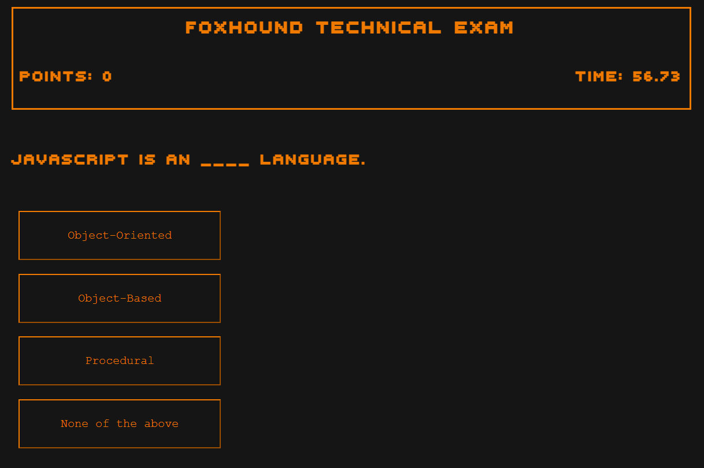

# quiz-app

[This technical exam](https://elrond-hubbard.github.io/quiz-app/) prompts the user with questions and  
multiple choice answers. 100 points are awarded for each correct question,  
and bonus points are awarded for extra time remaining on the clock. Submit your name  
to join the ranks of FOXHOUND!

## How To Use

To begin the exam, click "Begin".

Each question has four multiple-choice answers.  
Click the desired answer to proceed to the next question.  
Incorrect answers will deduct time from the clock.  
When the exam is complete, click "Print Dogtag" to  
add your name to the scoreboard.

## Credits

Music and SFX sourced from Metal Gear Solid (Konami, 1998)  
Font sourced from [dafont.com](https://www.dafont.com/000webfont.font)
Object Array structure pulled from [GreatStack](https://youtu.be/PBcqGxrr9g8)